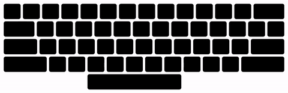

# keytracer

Visualize yourself typing by drawing lines between the keys as you hit them.

Here's an example where I type "The quick brown fox jumps over the lazy dog." in [Dvorak](https://en.wikipedia.org/wiki/Dvorak_Simplified_Keyboard):

